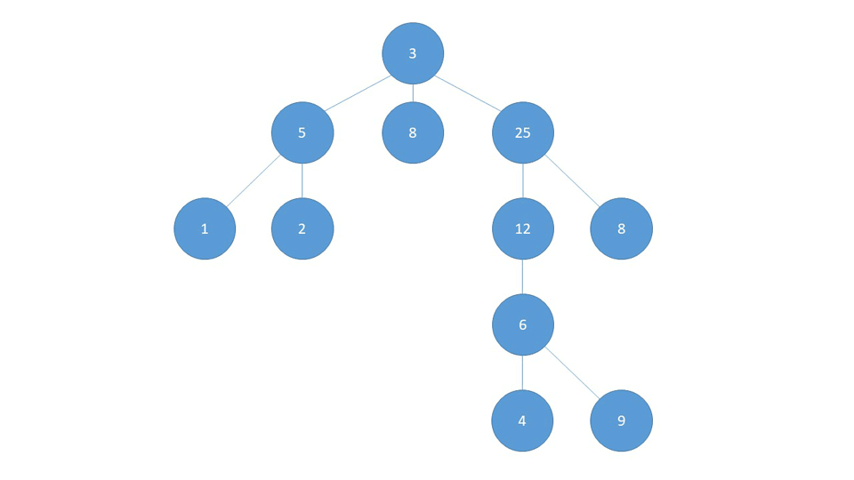
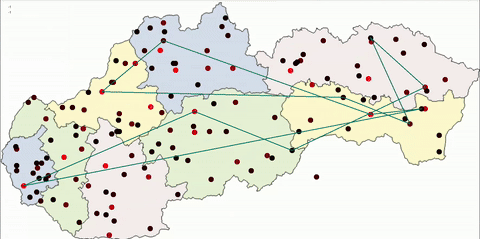
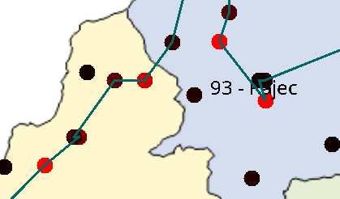
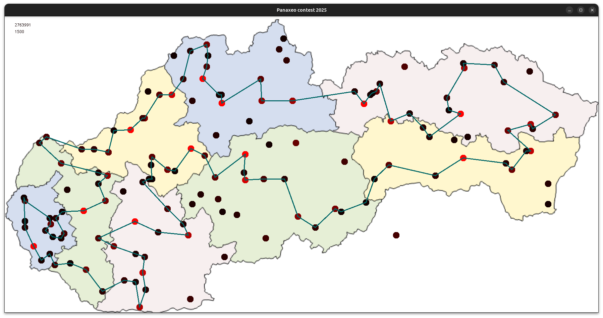
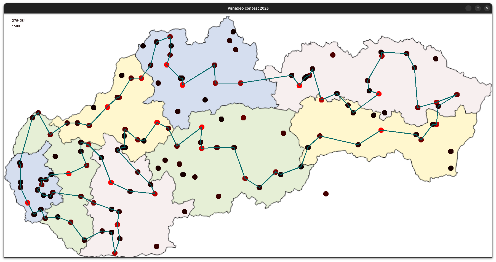

# Panaxeo 2025 Post Mortem

_Final standing: 2nd overall_

Ďakujem organizátorom za súťaž, v 2023 som sa o súťaži dozvedel deň pred záverom a tešil som sa na ďalšie kolo. Momentálne som učiteľom programovania v Novej Dubnice, predtým som 12 rokov programoval Android aplikácie, preto som ako jazyk zvolil Kotlin

## Messing around - prehľad algoritmov

Od prvého momentu bolo jasné, že sa zaoberáme problémom obchodného cestujúceho avšak s twistom = maximálnym doletom. Keďže som prvé týždne nemal veľa času skúsil som použiť bežné techniky.

### DFS a rekurzívny backtracking
Najprv jednoduchý DFS (depth first search alebo prehľadávanie do hĺbky) vygeneruje jednu cestu a potom skúša upravovať koniec cesty. Jeho najjednoduchšou variantou je rekurzívny backtracking. Tento postup je vhodné použiť ak chcem získať všetky cesty, alebo ak chcem získať akékoľvek (aj nie optimálne riešenie).


Ak sa gif nezobrazí, [klikni sem](images/dfs.gif)

Ak už nie je možné pokračovať v budovaní cesty, jednoducho zahodím poslednú stanicu a nahradím ju novou. Veľmi jednoduchý pseudokód:

```
cesta = empty_list
nepouzite_mesta = vsetky_mesta 

backtrack(cesta, nepouzite_mesta)
   ohodnot(cesta)
   for (mesto : nepouzite_mesta)
      ak mozem pridat mesto
	      cesta += mesto
	      nepouzite_mesta -= mesto
	      backtrack(cesta, nepouzite_mesta)
	      cesta -= mesto
	      nepouzite_mesta += mesto
```

Mestá som si vždy pred volaním cyklu zoradil podľa vzdialenosti od aktuálneho mesta. Týmto postupom som vedel dosiahnuť skóre okolo 2.300.000. Veľmi rýchlo som narazil na limity

### BFS a Beam search
Beam search je variáciou BFS (breadth-first-search alebo prehľadávanie do šírky). Dopadol rovnako, aj keď výsledky som mal okolo 2.500.000. Funguje tak, že pre aktuálnu cestu vyberie všetky možnosti pokračovania, a pridá ich do vyhľadávania. Potom vyberiem tú cestu, ktorá bola do zoznamu pridaná ako prvá. To zabezpečí, že v strome nepôjdem do šírky ale do hĺbky. Beam search modifikácia len zabezpečí, aby som na každej úrovni mal len obmedzený počet stavov.

```
bfs()
    queue.push(Gelnica)
    while(!empty(queue))
       cesta = queue.pop()
       ohodnot(cesta)
       for (mesto : vsetky_mesta - cesta)
          ak mozem pridat mesto
	         queue.push(mesto)
```

Tieto 2 algoritmy som vytiahol cca do 2 hodín, potom som sa problému nevenoval asi 2 týždne.

## Get real

### Visualization
Keďže robím v Kotline, bolo veľmi jednoduché spraviť si vizualizáciu v Java Swing, len stiahnuť peknú mapu, namapovať geo súradnice na jej rohy a začať kresliť. Vizualizácia vyzerá asi takto:
...

Pridal som možnosť manuálne pridávať a uberať body na ceste, aby som vedel aj manuálne vylepšovať riešenie:

Toto bola robota na pár hodín, keďže takto manuálne UI nezvyknem skladať.

### Simulované žíhanie setup

Genetický algoritmus ani ACO (ant colony optimization) tu popisovať nebudem, keďže som ich ani nedotiahol do konca. Simulované žíhanie bolo extrémne jednoduché nastaviť.

```
cesta = nahodna obsahujuca vsetky mesta
teplota = 10000000
alpha = 0.999999999
opakuj 10000000000
   sused = nahodny_sused(cesta)
   cesta = sused ak akceptacna_funkcia(cesta, sused, teplota)
   ohodnot(cesta)
```

Náhodneho suseda získam tak, že vyberiem 2 body na ceste a tie buď vymením, alebo otočím celú cestu medzi týmito bodmi. Tu mi s nápadmi pomohli LLM. Moje boli viac uletené a pomalé.
```
nahodny_sused(cesta)
   kopia = cesta
   i = random(1, dlzka(cesta) - 1)
   j = random(i + 1, dlzka(cesta))
   k = random(0, 1)
   if random == 0
      kopia[i] = cesta[j]
      kopia[j] = cesta[i]
   else
      kopia(0, i) + reverse(kopia(i, j)) + kopia(j, ..)
```
A akceptačná funkcia je klasická:
```
akceptacna_funkcia(cesta, sused, teplota)
   diff = skore(sused) - skore(cesta)
   if diff > 0 return true
   return random(0..1) < exp(diff / teplota)
```

S teplotou, alfou (cooldown rate) a poctom iteracii som sa chvilku hral, aby riešenie negenerovalo príliš dlho.  Napríklad riešenie s vyššie napísanými hodnotami mi trvalo 30 minút. Myslím, že k ďalšiemu postupu som zvolil asi 3 minúty/riešenie.

Simulovaným žíhaním som si nechal vygenerovať asi 100-150 riešení. Medzi nimi sa našlo niekoľko riešení, cez 2.700.000.


Ak sa gif nezobrazí, [klikni sem](images/sa.gif)

Takto vyzerá animovaný priebeh simulovaného žíhania.

### Iteratívny improvement

Tieto riešenia boli veľmi podobné a vizuálne sa podobali druhému najlepšiemu riešeniu. Rozhodol som sa pre iteratívne vylepšovanie. Vzal som každú dvojicu, trojicu, štvoricu (ďalej som sa nedostal) ciest a skúšal som všetky permutácie ich poradia aby som znížil prejdenú vzdialenosť. Týmto postupom som skrátil prejdenú cestu a mohol som pridať ďalšie mesto. Tak som sa dostal k druhému najlepšiemu riešeniu, len zamieňaním dvojíc. Trojice a štvorice som nechal počítač skúšať asi 2 dni a nenašiel nič lepšie.

"Prečo" by malo byť zjavné z tohto obrázka:



Nechcel som sa priznať, ale k tomu riešeniu som sa najprv dostal manuálnym klikaním do mapy :) Potom som to radšej podložil algoritmom.



### Concorde
Videl som, že, ktosi má ešte lepšie skóre a vďaka poznatkov z iteratívneho vylepšovania som vedel, že cesta musí mať nejakú bežne odmietanú cestu. Povedal som si, že tu môžem maximálne jedno mesto vymeniť.

Spomenul som si na nástroj [Concorde](https://math.uwaterloo.ca/tsp/concorde/), čo je C++ program na riešenie problému obchodného cestujúceho. Ten ale navštívi všetky zadané mestá (symetrical TSP). Napísal som kód, ktorý skúsil každé mesto v mojej najlepšej ceste nahradiť iným mestom a tento nový zoznam miest som prehnal cez concorde. Takto som sa dostal v priebehu pár sekúnd k najlepšiemu riešeniu.

A hneď je na ňom vidieť, kde presne sme všetci padli do lokálneho optima. Cesta z Holíča do Velkých Levárov vyzerá byť príliš drahá.



### Ďalšie pokusy
Potom som ešte skúšal vymieňať viacero miest, zahodiť jedno a nahradiť ho dvoma, troma inými. Po asi dvoch dňoch behu programu som to vzdal a ostal na druhom mieste. Tajne som presvedčený, že toto je optimálne riešenie.

## Takes

Problémy so súťažou:
- príliš málo miest (zvlášť na východe Slovenska) malo za následok len zopár hlavných ťahov
- podľa skóre som vedel presne zistiť, ktoré mestá hráči navštívili - toto by som vedel zneužiť na okamžité kopírovanie súperov (tento údaj + concorde)

Veľmi dobre bol ale zvolený dolet helikoptéry.

Ešte raz ďakujem Panaxeo za súťaž a teším sa na ďalší event.

Ak máte niekto záujem o riešenie zaujímavých problémov, pozývam vás na platformu Codingame ([invite link](https://www.codingame.com/servlet/urlinvite?u=3996809)).
